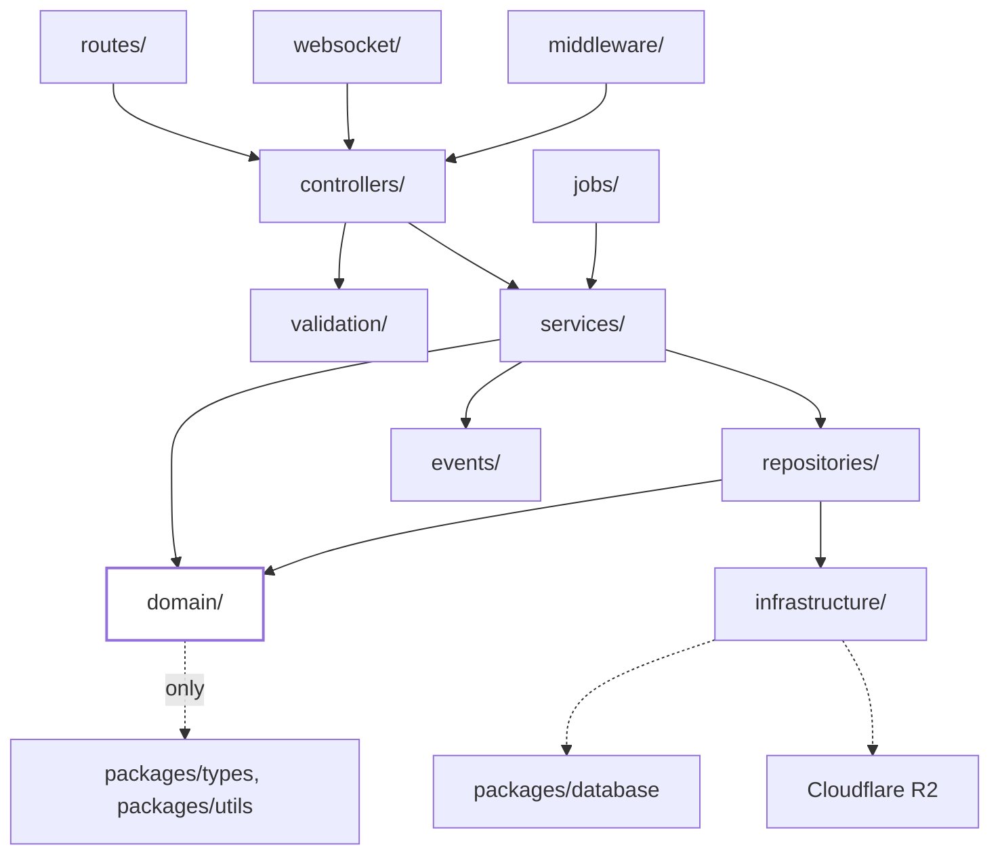

# Backend Architecture

**Status: Draft v1 — authored 2026-07-24, pending review**

Server structure for `apps/server` (Hono, per
[ADR-0004](../adr/ADR-0004-hono.md)), following the Clean Architecture
layering established in
[System-Architecture.md](./System-Architecture.md#architectural-style).
No implementation — folder names and responsibilities only. Dependency
rules across these layers are enforced conceptually here and specified
precisely in [Dependency-Rules.md](./Dependency-Rules.md#backend-layer-rules-within-appsserver).

## Layers

```
apps/server/src/
  routes/          — HTTP/WebSocket route definitions
  controllers/      — request/response translation
  services/          — application/use-case orchestration
  domain/             — core business logic and rules
  repositories/       — data access interfaces + implementations
  infrastructure/     — external systems (DB client, object storage, etc.)
  middleware/          — cross-cutting request pipeline concerns
  validation/           — input schema validation
  websocket/             — real-time connection handling
  jobs/                   — background/scheduled work
  events/                  — internal event definitions and handlers
```

### routes/

Maps HTTP methods + paths (and WebSocket upgrade paths) to controllers.
No business logic. No direct database access. Thin by design — a route
file should be readable as a table of endpoints.

### controllers/

Translates between the transport layer (HTTP request/response, or a
WebSocket message) and the application layer. Parses/validates input
(delegating to `validation/`), calls the appropriate `services/`
function, and shapes the response. No business rules live here — a
controller orchestrates, it doesn't decide.

### services/

Orchestrates one or more `domain/` operations and `repositories/` calls
to fulfill a use case (e.g. "create a session," "join a session,"
"save a contact"). This is where a single user-facing action's steps
are sequenced. Services depend on `domain/` and `repositories/`
interfaces, never on `infrastructure/` directly.

### domain/

Core business logic and rules — the "what does this concept mean and
what's allowed" layer (e.g. session expiry rules, what makes a contact
save valid). Zero dependencies on any other backend layer, and zero
dependencies on Hono, Drizzle, or any framework. May depend only on
`packages/types` and `packages/utils`. This is what stays fully
unit-testable with no infrastructure.

### repositories/

Defines data-access interfaces used by `services/`, plus their
implementations backed by `packages/database`. This is the seam where
`domain`/`services` are decoupled from the concrete database technology
— a repository interface could theoretically be backed by something
other than PostgreSQL without `services/`/`domain/` changing.

### infrastructure/

Concrete integrations with external systems: the PostgreSQL client
setup (via `packages/database`), Cloudflare R2 client (per
[ADR-0011](../adr/ADR-0011-cloudflare-r2.md)), and any other
third-party service integration. Repositories depend on infrastructure;
domain and services do not depend on it directly.

### middleware/

Cross-cutting request-pipeline concerns applied across routes:
authentication/session extraction, request logging, rate limiting,
error handling. Runs before/around controllers, not a substitute for
controller-level validation.

### validation/

Input schema definitions (request bodies, query params, WebSocket
message payloads) used by controllers before data reaches services.
Centralized so validation rules aren't duplicated per route.

### websocket/

Connection lifecycle and message handling for real-time session
messaging (per
[User Journey & Flow Specification](../product/user-journey-and-flow-specification.md)).
Delegates business logic to `services/`, same as `routes/` does for
HTTP — it is a second transport, not a second business-logic layer.

### jobs/

Background/scheduled work — e.g. expiring sessions past their window
(per the ephemeral-first principle in
[Architecture Overview](./Architecture-Overview.md#architectural-principles)).
Jobs call into `services/`, they don't reimplement business logic
inline.

### events/

Internal event definitions (e.g. "session expired," "contact saved")
and their handlers, for decoupling side effects (like a future
notification service) from the service that triggers them. Optional to
use per-feature; not every use case needs an event.

## Diagram



## Related Documents

- [System-Architecture.md](./System-Architecture.md)
- [Dependency-Rules.md](./Dependency-Rules.md)
- [Package-Architecture.md](./Package-Architecture.md)
