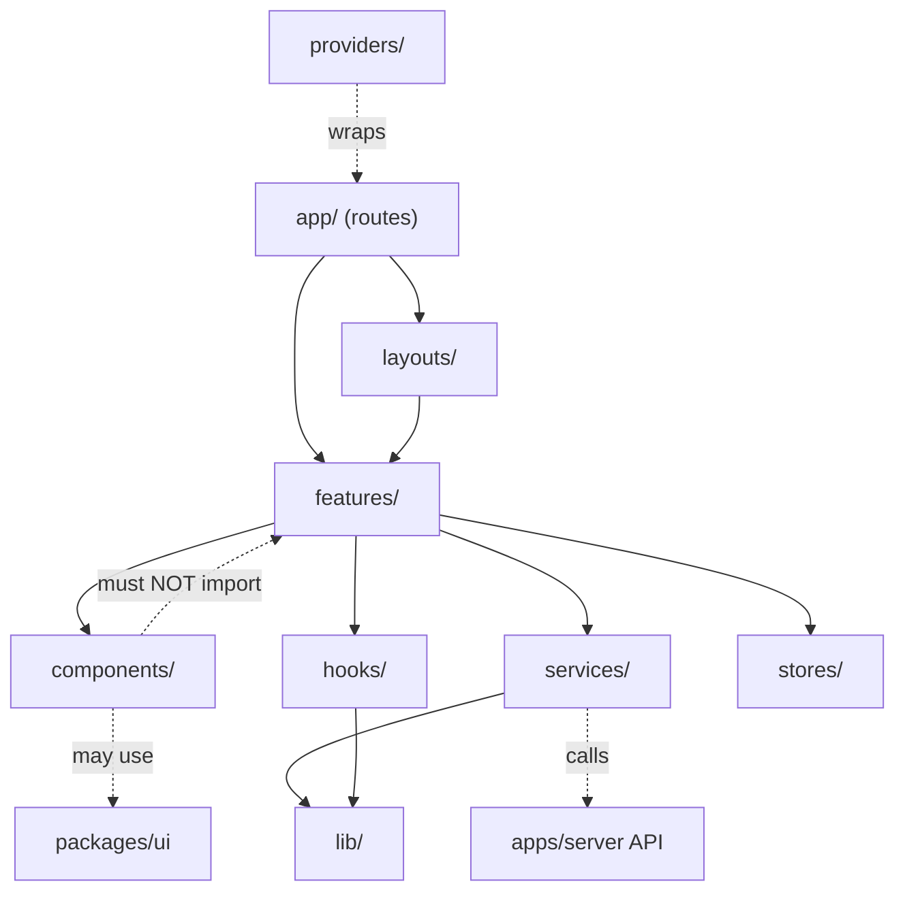

# Frontend Architecture

**Status: Draft v1 — authored 2026-07-24, pending review**

Structure for `apps/web` (Next.js, per
[ADR-0003](../adr/ADR-0003-nextjs.md)), following the feature-first
convention already established in
[coding-standards.md](../engineering/coding-standards.md#folder-conventions).
No implementation — folder names and responsibilities only. Dependency
rules are specified precisely in
[Dependency-Rules.md](./Dependency-Rules.md#frontend-layer-rules-within-appsweb).

## Layers

```
apps/web/src/
  app/            — Next.js App Router: routes, pages, route handlers
  layouts/         — shared layout shells composed by app/ routes
  features/         — product-specific composed functionality (feature-first)
  components/         — generic, reusable, presentation-only components
  hooks/               — reusable React hooks (non-server-state)
  services/              — API client calls (wraps TanStack Query)
  stores/                 — Zustand client-state stores
  lib/                     — framework-agnostic client-side helpers
  providers/                — React context providers (theme, query client, etc.)
  assets/                    — static assets (images, fonts, icons)
```

### app/

Next.js App Router structure: route segments, pages, route handlers,
loading/error boundaries. Composes `layouts/` and `features/` — contains
minimal logic of its own beyond routing and data-loading wiring.

### layouts/

Shared layout shells (e.g. an authenticated-session shell, a marketing
shell) used by multiple routes in `app/`. Presentation structure only,
no business logic.

### features/

Product-specific composed functionality — e.g. "session join flow,"
"contact save prompt" (mapping to the journeys in
[User Journey & Flow Specification](../product/user-journey-and-flow-specification.md)).
A feature composes `components/`, `hooks/`, `services/`, and `stores/`
into a cohesive piece of product behavior. This is where PINChat-specific
logic lives — never in `components/` or `packages/ui`.

### components/

Generic, reusable, presentation-only components local to `apps/web`
(not shared with other apps, unlike `packages/ui`). If a component
becomes genuinely reusable across a future second BlueMoon client, it's
a candidate for promotion to `packages/ui` — see
[Package-Architecture.md](./Package-Architecture.md#packagesui).

### hooks/

Reusable React hooks that aren't server-state concerns (those live in
`services/`, backed by TanStack Query per
[ADR-0010](../adr/ADR-0010-tanstack-query.md)) — e.g. a hook wrapping
`Zustand` store selectors, or local UI-state hooks reused across
features.

### services/

API client functions and their TanStack Query hooks (queries/mutations)
that talk to `apps/server`'s HTTP/WebSocket API. This is the only layer
that should perform network requests — `features/`, `components/` call
into `services/`, not `fetch` directly.

### stores/

Zustand stores (per [ADR-0009](../adr/ADR-0009-zustand.md)) for
client-only state — active session UI state, draft input, local flags.
Must not duplicate state that `services/` (TanStack Query) already owns
as server state — see the split documented in ADR-0009's consequences.

### lib/

Framework-agnostic client-side helper functions (formatting, small pure
logic) specific to `apps/web`. The app-local counterpart to
`packages/utils` — promote to `packages/utils` only if genuinely needed
by another app too.

### providers/

React context providers wrapping the app tree — theme provider, the
TanStack Query client provider, any future global provider. Composed
once, near the root, consumed by `app/` layouts.

### assets/

Static assets — images, fonts, icons — with no logic.

## Diagram



## Dependency Rules (summary)

- `app/` and `layouts/` may depend on `features/`, `components/`,
  `providers/`.
- `features/` may depend on `components/`, `hooks/`, `services/`,
  `stores/`, `lib/`.
- `components/` must **not** depend on `features/` — the dependency
  only goes one direction (generic → specific, never back).
- `services/` is the only layer allowed to perform network requests.
- `stores/` holds client state only; server-derived data goes through
  `services/` (TanStack Query), never duplicated into a Zustand store.

Full matrix: [Dependency-Rules.md](./Dependency-Rules.md#frontend-layer-rules-within-appsweb).

## Related Documents

- [System-Architecture.md](./System-Architecture.md)
- [Dependency-Rules.md](./Dependency-Rules.md)
- [Package-Architecture.md](./Package-Architecture.md)
