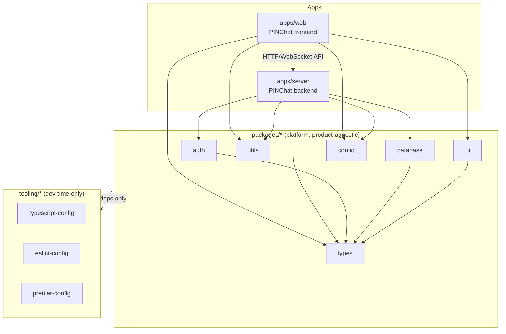

# System Architecture

**Status: Draft v1 — authored 2026-07-24, pending review**

This document defines the architectural style every future BlueMoon
feature must follow. It describes structure and rules, not
implementation — no messaging, auth, or database entities are designed
here. See [Backend-Architecture.md](./Backend-Architecture.md) and
[Frontend-Architecture.md](./Frontend-Architecture.md) for the layer
breakdown within each app, [Package-Architecture.md](./Package-Architecture.md)
for what each shared package owns, and
[Dependency-Rules.md](./Dependency-Rules.md) for the enforced import
matrix.

## Architectural Style

**Modular monolith, with Clean Architecture layering inside each app,
and a platform/product split at the workspace level.**

- *Modular monolith*, not microservices: `apps/web` and `apps/server`
  are each a single deployable unit today, internally organized into
  clearly bounded modules. This matches "boring where it doesn't
  matter" from
  [Architecture Overview](./Architecture-Overview.md#design-philosophy) —
  microservice operational overhead isn't justified at current scale,
  but internal modularity keeps a future service extraction possible
  without a rewrite.
- *Clean Architecture layering* inside `apps/server` (see
  [Backend-Architecture.md](./Backend-Architecture.md)): dependencies
  point inward toward domain logic, which has no framework or
  infrastructure dependencies.
- *Platform/product split*: shared, product-agnostic capabilities
  (auth/session primitives, database access, types, utils, UI
  primitives, config) live in `packages/*`. Product-specific behavior
  (PINChat's flows today; Communities, Voice, Video, AI, Storage in the
  future) is assembled from those packages inside product-specific
  apps. This is what makes "multiple future products" possible without
  duplicating the platform core — see
  [Product Vision & Philosophy](../product/product-vision-and-philosophy.md#5-built-for-the-long-term).

## Dependency Direction

Two independent dependency rules apply simultaneously:

1. **Clean Architecture direction (within an app):** outer layers
   depend on inner layers, never the reverse.

   ```
   infrastructure → repositories → services → controllers → routes
                          ↓             ↓
                       domain ←─────────┘
   ```

   `domain` depends on nothing else in the app. Everything else depends
   on `domain`, directly or indirectly, never the other way around.
   Full detail: [Backend-Architecture.md](./Backend-Architecture.md).

2. **Workspace direction (across apps/packages/tooling):** apps depend
   on packages; packages never depend on apps.

   ```
   apps/web ──┐
              ├──→ packages/* ──→ tooling/*
   apps/server ┘
   ```

   Full matrix: [Dependency-Rules.md](./Dependency-Rules.md).

These two rules compose: a `packages/database` repository
implementation is an "infrastructure"-layer concern from
`apps/server`'s point of view, but `packages/database` itself is a leaf
in the workspace dependency graph — it depends on nothing in `apps/*`.

## Package Boundaries (summary)

Full detail in [Package-Architecture.md](./Package-Architecture.md).
Six packages exist; no new package is added without a documented
justification (circular-dependency risk, unclear ownership, and
workspace sprawl are the costs of adding packages casually):

| Package | Owns |
|---|---|
| `packages/auth` | Session/PIN/identity primitives |
| `packages/database` | Schema, migrations, query layer |
| `packages/types` | Shared TypeScript contracts |
| `packages/utils` | Framework-agnostic pure functions |
| `packages/ui` | Shared UI component primitives |
| `packages/config` | Environment/config parsing |

## Application Boundaries

| App | Responsibility | Depends on |
|---|---|---|
| `apps/web` | PINChat frontend — presentation only, no source of truth | `packages/ui`, `packages/types`, `packages/config`, `packages/utils` |
| `apps/server` | PINChat backend — owns business logic and persistence | `packages/auth`, `packages/database`, `packages/types`, `packages/config`, `packages/utils` |

Future product apps (e.g. a Communities or Voice backend) would depend
on the same platform packages (`auth`, `database`, `types`, `utils`,
`config`) rather than duplicating session/identity/storage logic — this
is the concrete mechanism behind the "platform, not app" principle.
`apps/web` never depends on `apps/server` or vice versa; they
communicate only over the HTTP/WebSocket API surface documented in
`docs/api`.

## Shared Library Responsibilities

Shared packages own **capabilities**, not **products**. A package must
be usable by more than one current-or-future app without modification
to count as correctly scoped — see
[Package-Architecture.md](./Package-Architecture.md#the-shared-not-product-specific-rule)
for the enforcement rule.

## System Diagram



## Future Products Fit

The platform/product split is validated against the future modules
already listed in
[Architecture Overview](./Architecture-Overview.md#future-modules-anticipated-not-committed) —
Communities, Voice, Video, AI, Storage:

- Each would be a new `apps/*` entry (e.g. `apps/communities-server`),
  consuming the same `packages/auth`, `packages/database`,
  `packages/types`.
- Product-specific storage needs (e.g. Voice/Video media) extend
  `packages/database` schemas or introduce a scoped new package only
  with justification recorded per
  [Package-Architecture.md](./Package-Architecture.md#adding-a-new-package).
- `packages/ui` grows a shared design system usable by every future
  web client, not just PINChat's.

## Validation & Risks

Reviewed for circular dependencies, scalability, testability, fit for
future products, and developer experience:

- **Circular dependencies:** none possible by construction — packages
  never import from `apps/*` (enforced, see
  [Dependency-Rules.md](./Dependency-Rules.md)), and package-to-package
  imports are restricted to always point toward `types`/`utils`
  (leaves), never back out. Risk: nothing today enforces this at lint
  time — flagged as a gap below.
- **Scalability:** modular monolith defers infrastructure complexity
  until it's actually needed; internal layering (Clean Architecture in
  `apps/server`) means a module can be extracted into its own service
  later without redesigning business logic, only its transport/wiring.
- **Testability:** domain logic with zero infrastructure dependencies
  (per Clean Architecture) is unit-testable without a database or
  network; repositories/infrastructure are the natural integration-test
  boundary. See [testing expectations](./../engineering/coding-standards.md#testing-conventions).
- **Future products:** validated above — platform packages are the
  reuse mechanism, not a rewrite.
- **Developer experience:** six packages with narrow, named
  responsibilities is easy to hold in your head; the risk is scope
  creep inside a package (e.g. `utils` slowly absorbing business logic)
  more than proliferation of packages.

**Identified risks / recommended follow-ups (not yet implemented):**

1. **No automated enforcement of dependency rules yet.** ESLint import
   boundary rules (e.g. `eslint-plugin-boundaries` or a custom rule in
   `tooling/eslint-config`) should be added in a future milestone so
   violations fail CI rather than relying on code review.
2. **`packages/utils` scope creep risk.** Without a firm rule, "utility"
   functions tend to absorb business logic over time. Addressed in
   [Package-Architecture.md](./Package-Architecture.md#packagesutils),
   but needs active review discipline, not just documentation.
3. **`packages/config` vs. per-app env handling overlap.** Both
   `apps/web`/`apps/server` currently have their own `.env.example`
   (per [environment-strategy.md](../engineering/environment-strategy.md))
   and a `packages/config` package is planned to own parsing — the
   split between "which env vars exist" (per-app) and "how they're
   validated/parsed" (shared package) should be made explicit when
   `packages/config` is implemented.

## Related Documents

- [Package-Architecture.md](./Package-Architecture.md)
- [Dependency-Rules.md](./Dependency-Rules.md)
- [Backend-Architecture.md](./Backend-Architecture.md)
- [Frontend-Architecture.md](./Frontend-Architecture.md)
- [Architecture Overview](./Architecture-Overview.md)
- [Tech-Stack-Decision.md](./Tech-Stack-Decision.md)
