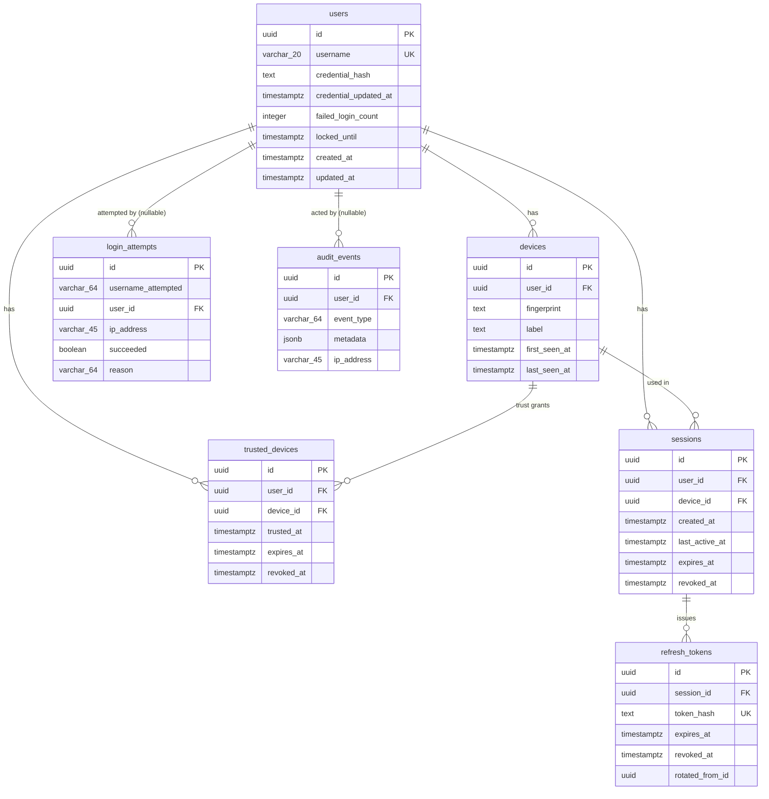

# Identity Schema

**Status: Draft v1 — authored 2026-07-25, pending review. Schema, migration, and constraints verified against a real PostgreSQL instance in Milestone 0.8 (see docs/phases/Phase-0.8.md) — "pending review" refers to founder sign-off, not technical correctness.**

Documents the seven tables implemented in
`packages/database/src/schema/` for the Identity bounded context
(Milestone 0.6). No other domain's schema exists yet. See
[Package-Architecture.md](../architecture/Package-Architecture.md#packagesdatabase)
for what `packages/database` owns, and
[ADR-0023](../adr/ADR-0023-identity-domain-model.md) for the domain
model these tables back.

## Entity-Relationship Diagram

## Table Reference

### `users`

Platform identity accounts — see
[Authentication.md](../security/Authentication.md#platform-identity).

| Column                      | Type                  | Notes                                                                                                                   |
| --------------------------- | --------------------- | ----------------------------------------------------------------------------------------------------------------------- |
| `id`                        | uuid, PK              | Generated application-side (`generateUuid()`, not a DB default — see [ADR-0006](../adr/ADR-0006-drizzle.md) discussion) |
| `username`                  | varchar(20), unique   | Permanent, lowercase-normalized                                                                                         |
| `credential_hash`           | text                  | Argon2id hash, never plaintext                                                                                          |
| `credential_updated_at`     | timestamptz           | Set on registration and every rotation                                                                                  |
| `failed_login_count`        | integer, default 0    | Reset to 0 on successful login                                                                                          |
| `locked_until`              | timestamptz, nullable | Set when `failed_login_count` crosses the lockout threshold                                                             |
| `created_at` / `updated_at` | timestamptz           | Standard audit columns                                                                                                  |

Indexes: unique on `username` (from the `unique()` constraint).

### `devices`

| Column                           | Type                                       | Notes                                                  |
| -------------------------------- | ------------------------------------------ | ------------------------------------------------------ |
| `id`                             | uuid, PK                                   |                                                        |
| `user_id`                        | uuid, FK → `users.id`, `ON DELETE CASCADE` |                                                        |
| `fingerprint`                    | text                                       | Client-supplied device identifier                      |
| `label`                          | text, nullable                             | Optional human-readable name                           |
| `first_seen_at` / `last_seen_at` | timestamptz                                | `last_seen_at` touched on every login from this device |

Indexes: unique on `(user_id, fingerprint)`; index on `user_id`.

### `trusted_devices`

Separate from `devices` deliberately — see
[Session-Management.md](../security/Session-Management.md#devices--trust).

| Column       | Type                             | Notes                |
| ------------ | -------------------------------- | -------------------- |
| `id`         | uuid, PK                         |                      |
| `user_id`    | uuid, FK → `users.id`, cascade   |                      |
| `device_id`  | uuid, FK → `devices.id`, cascade |                      |
| `trusted_at` | timestamptz                      |                      |
| `expires_at` | timestamptz, nullable            | Null = never expires |
| `revoked_at` | timestamptz, nullable            |                      |

Indexes: on `user_id`, on `device_id`.

### `sessions`

| Column           | Type                             | Notes                                                                                                        |
| ---------------- | -------------------------------- | ------------------------------------------------------------------------------------------------------------ |
| `id`             | uuid, PK                         |                                                                                                              |
| `user_id`        | uuid, FK → `users.id`, cascade   |                                                                                                              |
| `device_id`      | uuid, FK → `devices.id`, cascade |                                                                                                              |
| `created_at`     | timestamptz                      |                                                                                                              |
| `last_active_at` | timestamptz                      | Touched on every refresh                                                                                     |
| `expires_at`     | timestamptz                      | Absolute max-lifetime cutoff — see [Session-Management.md](../security/Session-Management.md#lifetime-rules) |
| `revoked_at`     | timestamptz, nullable            |                                                                                                              |

Indexes: on `user_id`, `device_id`, `expires_at`.

### `refresh_tokens`

| Column            | Type                              | Notes                                                                                                                                                                                               |
| ----------------- | --------------------------------- | --------------------------------------------------------------------------------------------------------------------------------------------------------------------------------------------------- |
| `id`              | uuid, PK                          |                                                                                                                                                                                                     |
| `session_id`      | uuid, FK → `sessions.id`, cascade |                                                                                                                                                                                                     |
| `token_hash`      | text, unique                      | SHA-256 of the opaque raw token — never the raw value                                                                                                                                               |
| `expires_at`      | timestamptz                       |                                                                                                                                                                                                     |
| `revoked_at`      | timestamptz, nullable             | Set on rotation, logout, or revocation                                                                                                                                                              |
| `rotated_from_id` | uuid, nullable                    | Links to the token this one replaced. **Not FK-enforced** — a self-referencing FK was judged unnecessary complexity for a field only ever used for audit/lineage reading, not integrity enforcement |

Indexes: on `session_id`, on `rotated_from_id`.

### `login_attempts`

Append-only audit trail of every login attempt, successful or not —
distinct from `audit_events` in that it's specifically structured for
lockout/rate-limit-adjacent queries (by username, by IP, over time).

| Column               | Type                                                  | Notes                                                               |
| -------------------- | ----------------------------------------------------- | ------------------------------------------------------------------- |
| `id`                 | uuid, PK                                              |                                                                     |
| `username_attempted` | varchar(64)                                           | Raw submitted value, kept even if it doesn't resolve to a real user |
| `user_id`            | uuid, FK → `users.id`, `ON DELETE SET NULL`, nullable | Null when the username didn't resolve                               |
| `ip_address`         | varchar(45)                                           | Supports IPv6                                                       |
| `succeeded`          | boolean                                               |                                                                     |
| `reason`             | varchar(64), nullable                                 | e.g. `"user_not_found"`, `"invalid_credential"`, `"locked"`         |
| `created_at`         | timestamptz                                           |                                                                     |

Indexes: `(username_attempted, created_at)`, `(ip_address, created_at)`, `user_id`.

### `audit_events`

Generic, cross-cutting event log — see
[Authentication.md](../security/Authentication.md#audit) for the event
vocabulary.

| Column       | Type                                                  | Notes                                 |
| ------------ | ----------------------------------------------------- | ------------------------------------- |
| `id`         | uuid, PK                                              |                                       |
| `user_id`    | uuid, FK → `users.id`, `ON DELETE SET NULL`, nullable |                                       |
| `event_type` | varchar(64)                                           | One of the `IdentityEventType` values |
| `metadata`   | jsonb, nullable                                       | Event-specific extra context          |
| `ip_address` | varchar(45), nullable                                 |                                       |
| `created_at` | timestamptz                                           |                                       |

Indexes: `(user_id, created_at)`, `(event_type, created_at)`.

## Migration

Generated via `pnpm --filter @bluemoon/database db:generate` →
`packages/database/migrations/0000_lame_deadpool.sql`. Not yet applied
against a real PostgreSQL instance — no instance has been available in
this environment (tracked in [TODO.md](../../TODO.md)). Schema
correctness was verified by inspecting the generated SQL directly
(tables, indexes, and FK constraints all present and correct) and by
running the full application-layer flow against in-memory fake
repositories implementing the same interfaces — not against real
PostgreSQL.

## Related Documents

- [Authentication.md](../security/Authentication.md)
- [Session-Management.md](../security/Session-Management.md)
- [ADR-0023 Identity Domain Model](../adr/ADR-0023-identity-domain-model.md)
- [ADR-0005 PostgreSQL](../adr/ADR-0005-postgresql.md), [ADR-0006 Drizzle](../adr/ADR-0006-drizzle.md)
