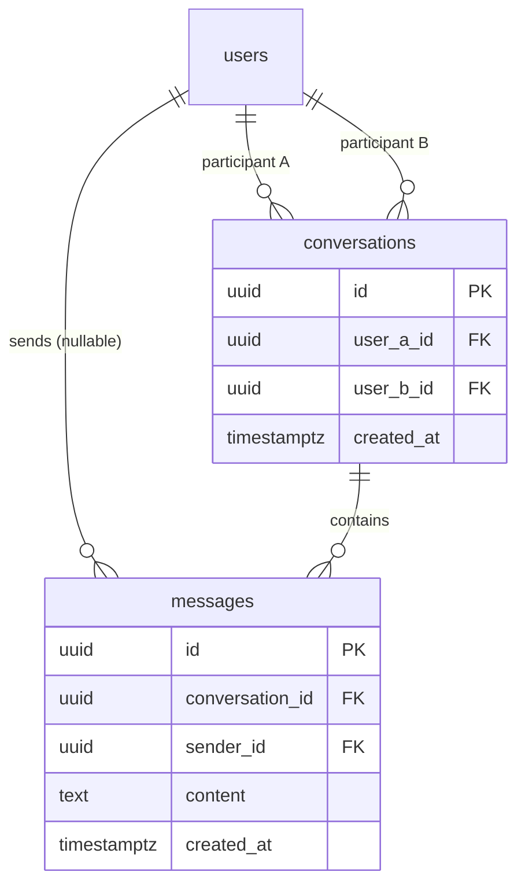

# Messaging Schema

**Status: Implemented and verified against real PostgreSQL — Milestone 1.0.**

Documents the two tables implemented in `packages/database/src/schema/`
for the Messaging bounded context: `conversations`, `messages`. See
[Identity-Schema.md](./Identity-Schema.md) for the `users` table both
reference, [Social-Schema.md](./Social-Schema.md) for the `friendships`
table that gates conversation creation (not an FK — see below), and
[ADR-0027](../adr/ADR-0027-messaging-friendship-gate-deviation.md)/
[ADR-0029](../adr/ADR-0029-message-encryption-deferred.md) for the two
deliberate deviations this milestone documents.

## Entity-Relationship Diagram

## Table Reference

### `conversations`

| Column       | Type                           | Notes                                             |
| ------------ | ------------------------------ | ------------------------------------------------- |
| `id`         | uuid, PK                       |                                                   |
| `user_a_id`  | uuid, FK → `users.id`, cascade | Canonical (lexicographically smaller) participant |
| `user_b_id`  | uuid, FK → `users.id`, cascade | Canonical (lexicographically larger) participant  |
| `created_at` | timestamptz                    |                                                   |

Indexes: unique on `(user_a_id, user_b_id)`; index on `user_a_id`;
index on `user_b_id`. Check constraint
`conversations_canonical_pair_order` (`user_a_id < user_b_id`)
enforces canonical storage order and rules out a self-conversation at
the database level — same pattern as `friendships` in
[Social-Schema.md](./Social-Schema.md#why-undirected-canonically-ordered-storage).
Both participant FKs cascade: a conversation is owned data of its two
participants, and either account's deletion should take it with it.

### `messages`

| Column            | Type                                                  | Notes                                                                                                 |
| ----------------- | ----------------------------------------------------- | ----------------------------------------------------------------------------------------------------- |
| `id`              | uuid, PK                                              |                                                                                                       |
| `conversation_id` | uuid, FK → `conversations.id`, cascade                | A message is owned by its conversation                                                                |
| `sender_id`       | uuid, FK → `users.id`, `ON DELETE SET NULL`, nullable | Attribution, not ownership — see below                                                                |
| `content`         | text                                                  | **Plaintext.** No encryption at rest — see [ADR-0029](../adr/ADR-0029-message-encryption-deferred.md) |
| `created_at`      | timestamptz                                           | Ordering column                                                                                       |

Indexes: composite on `(conversation_id, created_at)` — supports the
newest-first, cursor-paginated history query
(`MessageRepository.listForConversation`) without a full table scan.

## Why `sender_id` Is `SET NULL`, Not `CASCADE`

Every other participant-facing FK in this schema (`conversations`'
two columns, `friendships`' two columns) cascades, because those rows
are jointly owned by both participants — either one's account deletion
should remove them. A message's `sender_id` is different: it records
_who sent this message_, but the message itself belongs to the
conversation, which the **other** participant still has a legitimate
reason to keep. Cascading `sender_id` would mean deleting one user's
account destroys the other participant's message history — not this
user's data to unilaterally erase. This mirrors the existing
precedent of `audit_events.user_id` and
`blue_moon_tokens.consumed_by_user_id`
([Social-Schema.md](./Social-Schema.md)): attribution columns use
`SET NULL`, ownership columns cascade.

## Why No FK to `friendships`

Conversation creation is gated on an existing `Friendship` at the
application layer
(`services/messaging/get-or-create-conversation.service.ts`), not
enforced by a foreign key. A conversation is meant to outlive the
friendship that started it — if a friendship is later removed, any
existing conversation and its message history are not retroactively
deleted or orphaned. See
[ADR-0027](../adr/ADR-0027-messaging-friendship-gate-deviation.md) for
the broader reasoning behind gating on Friendship at all, as an
interim deviation from the canonical session/PIN model.

## Concurrency: `findOrCreateForUsers`

Same `INSERT ... ON CONFLICT DO NOTHING` + fallback `SELECT` technique
as `friendships`' token-consumption flow
(`ConversationRepository.findOrCreateForUsers`), but with a distinct
concurrency intent: BlueMoon Token consumption requires exactly one
concurrent caller to win (a security-sensitive single-use secret);
conversation creation requires every concurrent caller to succeed and
receive the identical row (idempotent creation is correct behavior for
"start a conversation," not a race to guard against). Verified
directly: three concurrent `findOrCreateForUsers` calls for the same
pair, against a real PostgreSQL instance, all resolve to the same
conversation id.

## Verification

Migration `0002_far_elektra.sql` applied cleanly to a fresh PostgreSQL
instance; all constraints, foreign keys, and indexes confirmed present
via `psql`. Repository-level real-database tests (13, in
`messaging-repositories.integration.test.ts`) cover constraint
enforcement, both cascade behaviors (`conversations` → cascade,
`messages.sender_id` → set null), idempotent and concurrent
`findOrCreateForUsers`, and newest-first cursor pagination. See
[Phase-1.0.md](../phases/Phase-1.0.md).
