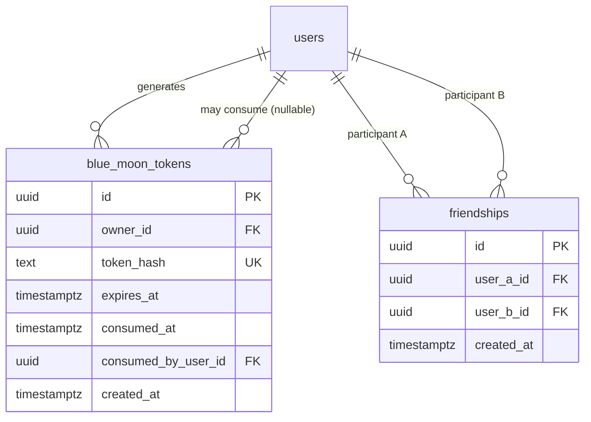

# Social Schema

**Status: Implemented and verified against real PostgreSQL — Milestone 0.9.**

Documents the two tables implemented in `packages/database/src/schema/`
for the Social bounded context: `blue_moon_tokens`, `friendships`. See
[Identity-Schema.md](./Identity-Schema.md) for the `users` table both
reference, and [ADR-0026](../adr/ADR-0026-blue-moon-token.md) for the
domain model and concurrency decisions.

## Entity-Relationship Diagram

## Table Reference

### `blue_moon_tokens`

| Column                | Type                                                  | Notes                                                            |
| --------------------- | ----------------------------------------------------- | ---------------------------------------------------------------- |
| `id`                  | uuid, PK                                              | Generated application-side, same convention as every other table |
| `owner_id`            | uuid, FK → `users.id`, cascade                        | The user who generated the token                                 |
| `token_hash`          | text, unique                                          | SHA-256 of the raw token — never the raw value itself            |
| `expires_at`          | timestamptz                                           | Set to 300 seconds after generation, never extended              |
| `consumed_at`         | timestamptz, nullable                                 | Set exactly once, atomically, on successful consumption          |
| `consumed_by_user_id` | uuid, FK → `users.id`, `ON DELETE SET NULL`, nullable | Who redeemed it — null until consumed                            |
| `created_at`          | timestamptz                                           | Standard audit column                                            |

Indexes: unique on `token_hash`; index on `owner_id`.

### `friendships`

| Column       | Type                           | Notes                                             |
| ------------ | ------------------------------ | ------------------------------------------------- |
| `id`         | uuid, PK                       |                                                   |
| `user_a_id`  | uuid, FK → `users.id`, cascade | Canonical (lexicographically smaller) participant |
| `user_b_id`  | uuid, FK → `users.id`, cascade | Canonical (lexicographically larger) participant  |
| `created_at` | timestamptz                    |                                                   |

Indexes: unique on `(user_a_id, user_b_id)`; index on `user_a_id`;
index on `user_b_id`. Check constraint `friendships_canonical_pair_order`
(`user_a_id < user_b_id`) enforces both canonical storage order and
that a user cannot friend themselves, at the database level — see
[ADR-0026](../adr/ADR-0026-blue-moon-token.md).

## Why Undirected, Canonically-Ordered Storage

A friendship has no "requester" once established — the token-gated
consumption is the single decisive act, not step one of a two-sided
accept flow (no such flow exists in this milestone). Storing an
unordered pair as `(smaller_id, larger_id)` with a unique constraint on
that pair means `(A, B)` and `(B, A)` are structurally the same row,
so there is exactly one way to test "are these two users friends,"
and duplicate-prevention is a plain unique index rather than an
application-level OR-query plus a race-prone check.

## Verification

Migration `0001_amusing_the_executioner.sql` applied cleanly to a
fresh PostgreSQL instance; all constraints, foreign keys, and indexes
confirmed present via `psql`. Repository and HTTP-level real-database
tests (39 total across Identity and Social) cover constraint
enforcement, cascade behavior, and — specifically for
`blue_moon_tokens` — concurrent consumption resolving to exactly one
winner. See [Phase-0.9.md](../phases/Phase-0.9.md).
